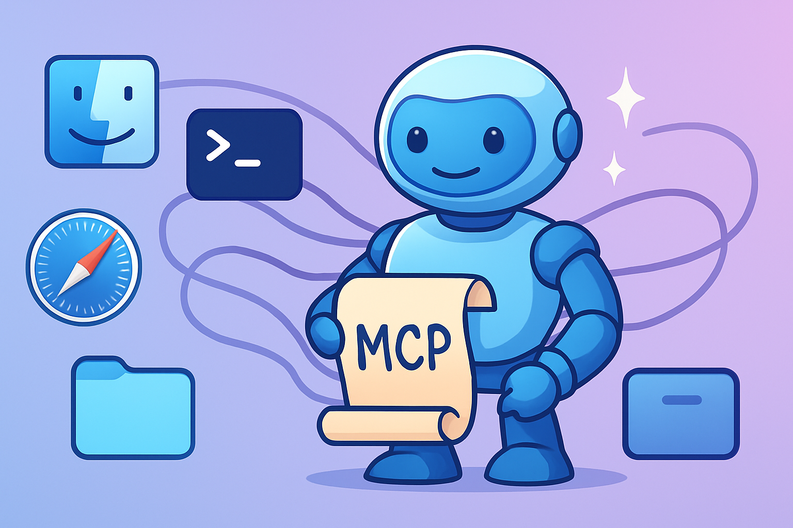

# macOS Automator MCP Server



## Overview
This project provides a Model Context Protocol (MCP) server, `macos_automator`, that allows execution of AppleScript and JavaScript for Automation (JXA) scripts on macOS. It features a knowledge base of pre-defined scripts accessible by ID and supports inline scripts, script files, and argument passing.
The knowledge base is loaded lazily on first use for fast server startup.

## Benefits
- Execute AppleScript/JXA scripts remotely via MCP.
- Utilize a rich, extensible knowledge base of common macOS automation tasks.
- Control macOS applications and system functions programmatically.
- Integrate macOS automation into larger AI-driven workflows.

## Prerequisites
- Node.js (version >=18.0.0 recommended, see `package.json` engines).
- macOS.
- **CRITICAL PERMISSIONS SETUP:**
    - The application running THIS MCP server (e.g., Terminal, your Node.js application) requires explicit user permissions on the macOS machine where the server is running.
    - **Automation Permissions:** To control other applications (Finder, Safari, Mail, etc.).
        - Go to: System Settings > Privacy & Security > Automation.
        - Find the application running the server (e.g., Terminal) in the list.
        - Ensure it has checkboxes ticked for all applications it needs to control.
        - See example: `docs/automation-permissions-example.png` (placeholder image).
    - **Accessibility Permissions:** For UI scripting via "System Events" (e.g., simulating clicks, keystrokes).
        - Go to: System Settings > Privacy & Security > Accessibility.
        - Add the application running the server (e.g., Terminal) to the list and ensure its checkbox is ticked.
        - See example: `docs/accessibility-permissions-example.png` (placeholder image).
    - First-time attempts to control a new application or use accessibility features may still trigger a macOS confirmation prompt, even if pre-authorized. The server itself cannot grant these permissions.

## Installation & Usage

The primary way to run this server is via `npx`. This ensures you're using the latest version without needing a global install.

Add the following configuration to your MCP client's `mcp.json` (or equivalent configuration):

```json
{
  "mcpServers": {
    "macos_automator": {
      "command": "npx",
      "args": [
        "-y",
        "@steipete/macos-automator-mcp@latest"
      ],
      "env": {
        "LOG_LEVEL": "INFO"
      }
    }
  }
}
```

### Running Locally (for Development or Direct Use)

Alternatively, for development or if you prefer to run the server directly from a cloned repository, you can use the provided `start.sh` script. This is useful if you want to make local modifications or run a specific version.

1.  **Clone the repository:**
    ```bash
    git clone https://github.com/steipete/macos-automator-mcp.git
    cd macos-automator-mcp
    npm install # Ensure dependencies are installed
    ```

2.  **Configure your MCP client:**
    Update your MCP client's configuration to point to the absolute path of the `start.sh` script within your cloned repository.

    Example `mcp.json` configuration snippet:
    ```json
    {
      "mcpServers": {
        "macos_automator_local": {
          "command": "/absolute/path/to/your/cloned/macos-automator-mcp/start.sh",
          "env": {
            "LOG_LEVEL": "DEBUG"
          }
        }
      }
    }
    ```
    **Important:** Replace `/absolute/path/to/your/cloned/macos-automator-mcp/start.sh` with the correct absolute path on your system.

    The `start.sh` script will automatically use `tsx` to run the TypeScript source directly if a compiled version is not found, or run the compiled version from `dist/` if available. It respects the `LOG_LEVEL` environment variable.

    **Note for Developers:** The `start.sh` script, particularly if modified to remove any pre-existing compiled `dist/server.js` before execution (e.g., by adding `rm -f dist/server.js`), is designed to ensure you are always running the latest TypeScript code from the `src/` directory via `tsx`. This is ideal for development to prevent issues with stale builds. For production deployment (e.g., when published to npm), a build process would typically create a definitive `dist/server.js` which would then be the entry point for the published package.

## Tools Provided

### 1. `execute_script`

Executes an AppleScript or JavaScript for Automation (JXA) script on macOS. 
Scripts can be provided as inline content (`scriptContent`), an absolute file path (`scriptPath`), or by referencing a script from the built-in knowledge base using its unique `kbScriptId`.

**Script Sources (mutually exclusive):**
-   `scriptContent` (string): Raw script code.
-   `scriptPath` (string): Absolute POSIX path to a script file (e.g., `.applescript`, `.scpt`, `.js`).
-   `kbScriptId` (string): The ID of a pre-defined script from the server's knowledge base. Use the `get_scripting_tips` tool to discover available script IDs and their functionalities.

**Language Specification:**
-   `language` (enum: 'applescript' | 'javascript', optional): Specify the language.
    -   If using `kbScriptId`, the language is inferred from the knowledge base script.
    -   If using `scriptContent` or `scriptPath` and `language` is omitted, it defaults to 'applescript'.

**Passing Inputs to Scripts:**
-   `arguments` (array of strings, optional): 
    -   For `scriptPath`: Passed as standard arguments to the script's `on run argv` (AppleScript) or `run(argv)` (JXA) handler.
    -   For `kbScriptId`: Used if the pre-defined script is designed to accept positional string arguments (e.g., replaces placeholders like `--MCP_ARG_1`, `--MCP_ARG_2`). Check the script's `argumentsPrompt` from `get_scripting_tips`.
-   `inputData` (JSON object, optional): 
    -   Primarily for `kbScriptId` scripts designed to accept named, structured inputs.
    -   Values from this object replace placeholders in the script (e.g., `--MCP_INPUT:yourKeyName`). See `argumentsPrompt` from `get_scripting_tips`.
    -   Values (strings, numbers, booleans, simple arrays/objects) are converted to their AppleScript literal equivalents.

**Other Options:**
-   `timeoutSeconds` (integer, optional, default: 30): Maximum execution time.
-   `useScriptFriendlyOutput` (boolean, optional, default: false): Uses `osascript -ss` flag for potentially more structured output, especially for lists and records.
-   `includeExecutedScriptInOutput` (boolean, optional, default: false): If true, the output will include the full script content (after any placeholder substitutions for knowledge base scripts) or the script path that was executed. This is appended as an additional text part in the output content array.
-   `includeSubstitutionLogs` (boolean, optional, default: false): If true, detailed logs of placeholder substitutions performed on knowledge base scripts are included in the output. This is useful for debugging how `inputData` and `arguments` are processed and inserted into the script. The logs are prepended to the script output on success or appended to the error message on failure.

**SECURITY WARNING & MACOS PERMISSIONS:** (Same critical warnings as before about arbitrary script execution and macOS Automation/Accessibility permissions).

**Examples:**
-   (Existing examples for inline/file path remain relevant)
-   **Using Knowledge Base Script by ID:**
    ```json
    {
      "toolName": "execute_script",
      "input": {
        "kbScriptId": "safari_get_active_tab_url",
        "timeoutSeconds": 10
      }
    }
    ```
-   **Using Knowledge Base Script by ID with `inputData`:**
    ```json
    {
      "toolName": "execute_script",
      "input": {
        "kbScriptId": "finder_create_folder_at_path",
        "inputData": {
          "folderName": "New MCP Folder",
          "parentPath": "~/Desktop"
        }
      }
    }
    ```

### 2. `get_scripting_tips`

Retrieves AppleScript/JXA tips, examples, and runnable script details from the server's knowledge base. Useful for discovering available scripts, their functionalities, and how to use them with `execute_script` (especially `kbScriptId`).

**Arguments:**
-   `listCategories` (boolean, optional, default: false): If true, returns only the list of available knowledge base categories and their descriptions. Overrides other parameters.
-   `category` (string, optional): Filters tips by a specific category ID (e.g., "finder", "safari").
-   `searchTerm` (string, optional): Searches for a keyword within tip titles, descriptions, script content, keywords, or IDs.
-   `refreshDatabase` (boolean, optional, default: false): If true, forces a reload of the entire knowledge base from disk before processing the request. This is useful during development if you are actively modifying knowledge base files and want to ensure the latest versions are used without restarting the server.

**Output:**
-   Returns a Markdown formatted string containing the requested tips, including their title, description, script content, language, runnable ID (if applicable), argument prompts, and notes.

**Example Usage:**
-   List all categories:
    `{ "toolName": "get_scripting_tips", "input": { "listCategories": true } }`
-   Get tips for "safari" category:
    `{ "toolName": "get_scripting_tips", "input": { "category": "safari" } }`
-   Search for tips related to "clipboard":
    `{ "toolName": "get_scripting_tips", "input": { "searchTerm": "clipboard" } }`

## Key Use Cases & Examples

-   **Application Control:**
    -   Get the current URL from Safari: `{ "scriptContent": "tell application \"Safari\" to get URL of front document" }`
    -   Get subjects of unread emails in Mail: `{ "scriptContent": "tell application \"Mail\" to get subject of messages of inbox whose read status is false" }`
-   **File System Operations:**
    -   List files on the Desktop: `{ "scriptContent": "tell application \"Finder\" to get name of every item of desktop" }`
    -   Create a new folder: `{ "scriptContent": "tell application \"Finder\" to make new folder at desktop with properties {name:\"My New Folder\"}" }`
-   **System Interactions:**
    -   Display a system notification: `{ "scriptContent": "display notification \"Important Update!\" with title \"System Alert\"" }`
    -   Set system volume: `{ "scriptContent": "set volume output volume 50" }` (0-100)
    -   Get current clipboard content: `{ "scriptContent": "the clipboard" }`

## Troubleshooting

-   **Permissions Errors:** If scripts fail to control apps or perform UI actions, double-check Automation and Accessibility permissions in System Settings for the application running the MCP server (e.g., Terminal).
-   **Script Syntax Errors:** `osascript` errors will be returned in the `stderr` or error message. Test complex scripts locally using Script Editor (for AppleScript) or a JXA runner first.
-   **Timeouts:** If a script takes longer than `timeoutSeconds` (default 30s), it will be terminated. Increase the timeout for long-running scripts.
-   **File Not Found:** Ensure `scriptPath` is an absolute POSIX path accessible by the user running the MCP server.
-   **Incorrect Output:** Experiment with `useScriptFriendlyOutput: true` if the default human-readable output is not suitable for parsing (especially for lists or records).

## Configuration via Environment Variables

-   `LOG_LEVEL`: Set the logging level for the server.
    -   Values: `DEBUG`, `INFO`, `WARN`, `ERROR`
    -   Example: `LOG_LEVEL=DEBUG npx @steipete/macos-automator-mcp@latest`

-   `KB_PARSING`: Controls when the knowledge base (script tips) is parsed.
    -   Values:
        -   `lazy` (default): The knowledge base is parsed on the first request to `get_scripting_tips` or when a `kbScriptId` is used in `execute_script`. This allows for faster server startup.
        -   `eager`: The knowledge base is parsed when the server starts up. This may slightly increase startup time but ensures the KB is immediately available and any parsing errors are caught early.
    -   Example (when running via `start.sh` or similar):
        ```bash
        KB_PARSING=eager ./start.sh
        ```
    -   Example (when configuring via an MCP runner that supports `env`, like `mcp-agentify`):
        ```json
        {
          "env": {
            "LOG_LEVEL": "INFO",
            "KB_PARSING": "eager"
          }
        }
        ```

## For Developers

For detailed instructions on local development, project structure (including the `knowledge_base`), and contribution guidelines, please see [DEVELOPMENT.md](DEVELOPMENT.md).

## Development

See [DEVELOPMENT.md](./DEVELOPMENT.md) for details on the project structure, building, and testing.

## Local Knowledge Base

You can supplement the built-in knowledge base with your own local tips and shared handlers. Create a directory structure identical to the `knowledge_base` in this repository (or a subset of it).

By default, the application will look for this local knowledge base at `~/.macos-automator/knowledge_base`.
You can customize this path by setting the `LOCAL_KB_PATH` environment variable.

**Example:**

Suppose you have a local knowledge base at `/Users/yourname/my-custom-kb`.
Set the environment variable:
`export LOCAL_KB_PATH=/Users/yourname/my-custom-kb`

Or, if you are running the validator script, you can use the `--local-kb-path` argument:
`npm run validate:kb -- --local-kb-path /Users/yourname/my-custom-kb`

**Structure and Overrides:**

*   Your local knowledge base should mirror the category structure of the main `knowledge_base` (e.g., `01_applescript_core`, `05_web_browsers/safari`, etc.).
*   You can add new `.md` tip files or `_shared_handlers` (e.g., `.applescript` or `.js` files).
*   If a tip ID (either from frontmatter `id:` or generated from filename/path) in your local knowledge base matches an ID in the embedded knowledge base, your local version will **override** the embedded one.
*   Similarly, shared handlers with the same name and language (e.g., `my_utility.applescript`) in your local `_shared_handlers` directory will override any embedded ones with the same name and language within the same category (or globally if you place them at the root of your local KB's `_shared_handlers`).
*   Category descriptions from `_category_info.md` in your local KB can also override those from the embedded KB for the same category.

This allows for personalization and extension of the available automation scripts and tips without modifying the core application files.

## Contributing

Contributions are welcome! Please submit issues and pull requests to the [GitHub repository](https://github.com/steipete/macos-automator-mcp).

## Automation Capabilities

This server provides powerful macOS automation capabilities through AppleScript and JavaScript for Automation (JXA). Here are some of the most useful examples:

### Terminal Automation
- **Run commands in new Terminal tabs:**
  ```
  { "kbScriptId": "terminal_app_run_command_new_tab", "inputData": { "command": "ls -la" } }
  ```
- **Execute commands with sudo and provide password securely**
- **Capture command output for processing**

### Browser Control
- **Chrome/Safari automation:**
  ```
  { "kbScriptId": "chrome_open_url_new_tab_profile", "inputData": { "url": "https://example.com", "profileName": "Default" } }
  ```
  ```
  { "kbScriptId": "safari_get_front_tab_url" }
  ```
- **Execute JavaScript in browser context:**
  ```
  { "kbScriptId": "chrome_execute_javascript", "inputData": { "javascript": "document.title" } }
  ```
- **Extract page content, manipulate forms, and automate workflows**
- **Take screenshots of web pages**

### System Interaction
- **Toggle system settings (dark mode, volume, network):**
  ```
  { "kbScriptId": "systemsettings_toggle_dark_mode_ui" }
  ```
- **Get/set clipboard content:**
  ```
  { "kbScriptId": "system_clipboard_get_file_paths" }
  ```
- **Open/control system dialogs and alerts**
- **Create and manage system notifications**

### File Operations
- **Create, move, and manipulate files/folders:**
  ```
  { "kbScriptId": "finder_create_new_folder_desktop", "inputData": { "folderName": "My Project" } }
  ```
- **Read and write text files:**
  ```
  { "kbScriptId": "fileops_read_text_file", "inputData": { "filePath": "~/Documents/notes.txt" } }
  ```
- **List and filter files in directories**
- **Get file metadata and properties**

### Application Integration
- **Calendar/Reminders management:**
  ```
  { "kbScriptId": "calendar_create_event", "inputData": { "title": "Meeting", "startDate": "2023-06-01 10:00", "endDate": "2023-06-01 11:00" } }
  ```
- **Email automation with Mail.app:**
  ```
  { "kbScriptId": "mail_send_email_direct", "inputData": { "recipient": "user@example.com", "subject": "Hello", "body": "Message content" } }
  ```
- **Control music playback:**
  ```
  { "kbScriptId": "music_playback_controls", "inputData": { "action": "play" } }
  ```
- **Work with creative apps (Keynote, Pages, Numbers)**

Use the `get_scripting_tips` tool to explore all available automation capabilities organized by category.

## License

This project is licensed under the MIT License. See the [LICENSE](LICENSE) file for details. 