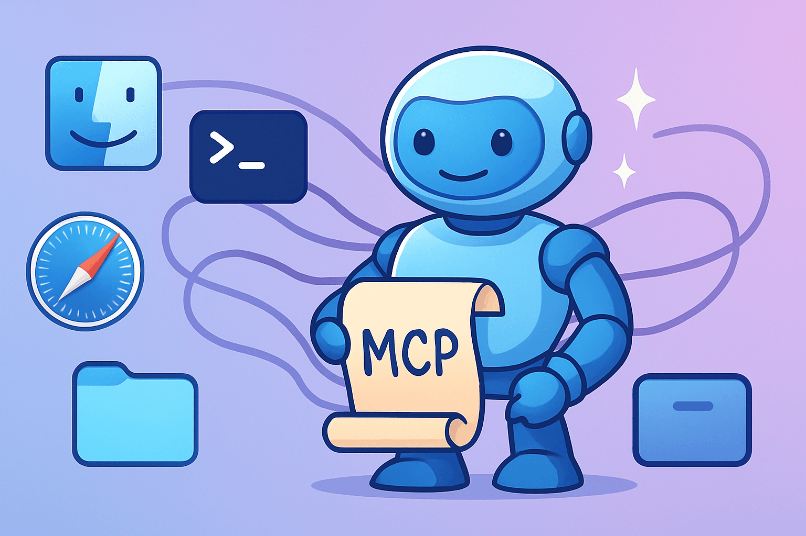

# macOS Automator MCP 🤖 — Give your agent a Mac to operate



[](https://github.com/steipete/macos-automator-mcp/actions/workflows/ci.yml)
[](https://registry.npmjs.org/@steipete%2Fmacos-automator-mcp/latest)
[](https://nodejs.org/)
[](https://www.apple.com/macos/)
[](LICENSE)

macOS Automator MCP is a Model Context Protocol server that lets MCP clients discover and run AppleScript or JavaScript for Automation (JXA). It is for agents that need to control macOS applications, inspect the system, or reuse scripts from a bundled knowledge base.

## Install

You need macOS and Node.js 24 or newer. Add the server to your MCP client's configuration; `npx` downloads the current npm release when the client starts it.

```json
{
  "mcpServers": {
    "macos_automator": {
      "command": "npx",
      "args": ["-y", "--package", "@steipete/macos-automator-mcp", "macos-automator-mcp"]
    }
  }
}
```

If your client has a separate package field, use `@steipete/macos-automator-mcp` without `@latest`.

## Quick start

Restart your MCP client after adding the configuration. First, ask it to call `get_scripting_tips` with a small search:

```json
{
  "search_term": "Safari front tab URL",
  "limit": 3
}
```

Then verify script execution with a read-only inline script through `execute_script`:

```json
{
  "script_content": "return \"Hello from macOS Automator\""
}
```

The result is `Hello from macOS Automator`. Calls that control applications or the user interface may prompt for macOS permissions.

## Tools

| Tool                 | Purpose                                                                |
| -------------------- | ---------------------------------------------------------------------- |
| `get_scripting_tips` | List knowledge-base categories or search for AppleScript and JXA tips. |
| `execute_script`     | Run one inline script, script file, or knowledge-base script ID.       |

Use `get_scripting_tips` before writing a script from scratch. A returned runnable ID can be passed to `execute_script` as `kb_script_id`; scripts with placeholders accept named `input_data` or positional `arguments`.

`execute_script` runs with the privileges of the process hosting the MCP server. Only run scripts you trust, and inspect generated scripts before allowing destructive actions. See the [tool reference](docs/tool-reference.md) for every input and response option.

## Permissions

The application that launches the MCP server—such as Terminal, an editor, or a desktop MCP client—owns its macOS privacy permissions:

- Grant **Automation** access when scripts control Finder, Safari, Mail, or another application.
- Grant **Accessibility** access when scripts use System Events for clicks, keystrokes, menus, or other UI scripting.

macOS may show a first-use prompt for each target application. The server cannot grant these permissions itself. See [configuration and permissions](docs/configuration.md) for setup and common error codes.

## Knowledge base

The package includes hundreds of AppleScript and JXA tips covering system tasks, files, browsers, terminals, productivity apps, developer tools, and UI automation. Search by keyword or category, then execute a result by its runnable ID.

A local knowledge base can add or override bundled tips without changing the package. It defaults to `~/.macos-automator/knowledge_base`; see [configuration and permissions](docs/configuration.md#local-knowledge-base) for its layout and override rules.

## Configuration

| Variable        | Values                                   | Default                             |
| --------------- | ---------------------------------------- | ----------------------------------- |
| `LOG_LEVEL`     | `DEBUG`, `INFO`, `WARN`, `ERROR`         | `INFO`                              |
| `KB_PARSING`    | `lazy`, `eager`                          | `lazy`                              |
| `LOCAL_KB_PATH` | Absolute path to a custom knowledge base | `~/.macos-automator/knowledge_base` |

`lazy` loads the knowledge base on first use; `eager` loads it at server startup. More detail is in [configuration and permissions](docs/configuration.md).

## Troubleshooting

- Permission errors such as `-1743` or `-10004` usually mean the host application needs Automation or Accessibility access.
- Script syntax errors are easiest to isolate with `include_executed_script_in_output` and `include_substitution_logs`, then reproduce in Script Editor.
- Use an absolute POSIX path with `script_path`, and raise `timeout_seconds` for scripts that legitimately need more than 60 seconds.
- JXA normally works best with `output_format_mode: "direct"`; the default `auto` mode selects it for JXA.

See [Debugging AppleScript and JXA](docs/debugging_applescript.md) for a longer diagnostic guide.

## Development

```sh
pnpm install
pnpm run build
pnpm test
pnpm run lint
pnpm run validate
```

The repository uses pnpm 11 and Node.js 24. The [development guide](docs/DEVELOPMENT.md) covers local server setup and knowledge-base contributions.

## Community

Report bugs and propose scripts in [GitHub Issues](https://github.com/steipete/macos-automator-mcp/issues).

<a href="https://glama.ai/mcp/servers/@steipete/macos-automator-mcp">
  
</a>

## License

[MIT](LICENSE)
